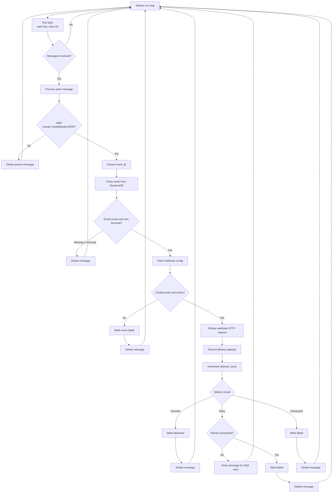

# HooRay-Relay
Production-grade webhook delivery system built with Rust and AWS. Reliable, scalable, and easy to deploy.

Current runtime split:
- Ingestion API runs as Lambda (SAM-managed).
- Delivery worker runs as a long-running SQS poller (non-Lambda) for MVP.
- See `docs/WORKER_RUNTIME.md` for worker deployment and e2e steps.

## Worker Workflow

