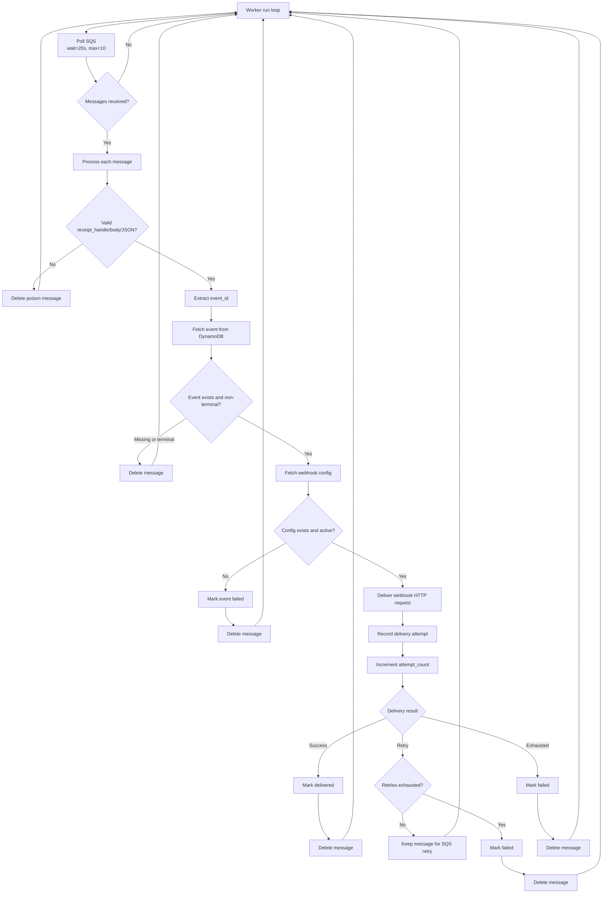

# HooRay-Relay
Production-grade webhook delivery system built with Rust and AWS. Reliable, scalable, and easy to deploy.

Current runtime split:
- Ingestion API runs as Lambda (SAM-managed).
- Delivery worker runs as a long-running SQS poller (non-Lambda) for MVP.
- See `docs/WORKER_RUNTIME.md` for worker deployment and e2e steps.

Release readiness:
- [Release 1.0.0 Go / No-Go Checklist](docs/release-1.0.0-go-no-go-checklist.md)
- [Release 1.0.0 Notes](docs/release-1.0.0-notes.md)
- [Networking Hardening Checklist](docs/networking-hardening-checklist.md)
- [Rollback Runbook](docs/rollback.md)

## Worker Workflow



## Load Testing (k6)

The shared load test script lives in `tests/load_test.js` and supports multiple
profiles:

- `MODE=steady` for constant-arrival-rate tests (default)
- `MODE=ramping` for ramp-up/ramp-down VU stages
- `MODE=seed` + `TARGET_EVENTS=...` for fixed-volume seeding

Key environment variables:

- `API_URL` (or `BASE_URL`) — ingestion API base URL
- `API_KEY` — API Gateway key (if required)
- `CUSTOMER_ID` — test customer ID
- `SUMMARY_JSON_PATH` — optional JSON summary output path

Example runs:

```bash
# Constant-arrival test at 500 req/sec for 2 minutes
API_URL="https://<api-id>.execute-api.<region>.amazonaws.com/Prod" \
MODE=steady RATE=500 DURATION=2m \
SUMMARY_JSON_PATH="tests/loadtest-summary.json" \
k6 run tests/load_test.js

# Fixed-volume seed run (useful for worker-side throughput checks)
API_URL="https://<api-id>.execute-api.<region>.amazonaws.com/Prod" \
MODE=seed TARGET_EVENTS=1000 ITERATION_VUS=50 \
SUMMARY_JSON_PATH="tests/loadtest-summary.json" \
k6 run tests/load_test.js
```

For Day 9 artifact generation, prefer the committed wrapper:

```bash
API_URL="https://<api-id>.execute-api.<region>.amazonaws.com/Prod" \
TARGET_EVENTS=1000 ITERATION_VUS=50 \
bash scripts/day9_seed_and_report.sh
```

This writes `meta.env`, `k6-summary.json`, and a sanitized `env.snapshot` under `artifacts/day9/<test_run_id>/`.
